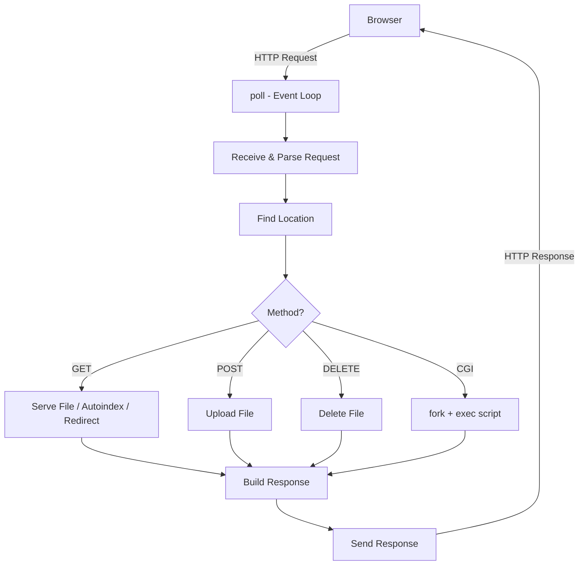
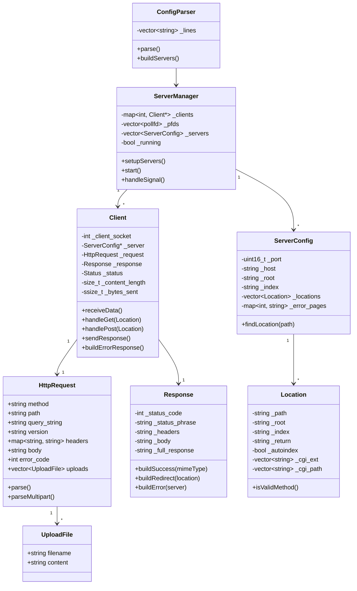

# Common Core - HTTP Web Server

A from-scratch HTTP/1.1 web server implementation in C++98 that handles concurrent client connections using I/O multiplexing, without threads. Built as part of the 42 School curriculum.

## Features

| Feature | Description |
|---------|-------------|
| **Static file serving** | Serves HTML, CSS, JS, images, PDFs with correct MIME types |
| **GET** | File serving, directory index, autoindex, HTTP redirects (301) |
| **POST** | File uploads via multipart/form-data, chunked transfer encoding |
| **DELETE** | Delete files from the server |
| **CGI execution** | Runs Python (`.py`) and Bash (`.sh`) scripts via fork/exec |
| **Autoindex** | Generates directory listing when no index file is present |
| **Custom error pages** | Configurable per status code (404, 405, etc.) |
| **Path traversal protection** | Blocks `..` in request paths |
| **nginx-like configuration** | Server blocks, location blocks, routes, redirects |
| **Non-blocking I/O** | Handles multiple clients simultaneously with `poll()` |
| **Multiple ports** | Listen on multiple ports in the same config |


## Architecture




## Configuration

The server uses an nginx-inspired configuration format:

```nginx
server {
    listen 8080;
    host 127.0.0.1;
    server_name localhost;
    root docs/fusion_web/;
    index index.html;
    client_max_body_size 1048576;
    error_page 404 /error/404.html;

    location /cgi-bin {
        allow_methods GET POST;
        cgi_path /usr/bin/python3;
        cgi_ext .py .sh;
    }

    location /upload {
        allow_methods POST DELETE;
        client_max_body_size 2097152;
    }
}
```

## Build & Run

```bash
# Webserv_42 (complete)
cd Webserv_42
make
./webserv                    # uses configs/default.conf
./webserv configs/custom.conf

# webserver (in development)
cd webserver
make
./webserv
```


## Dependencies

None. The project uses only:
- C++98 Standard Library
- POSIX/BSD socket API (`sys/socket.h`, `netinet/in.h`, `sys/select.h`)

## Component Overview



## How It Works

1. **Startup**: `ConfigParser` reads the config file and creates `ServerConfig` objects
2. **Binding**: `ServerManager` creates listening sockets for each server block
3. **Event Loop**: `select()` monitors all file descriptors for read/write readiness
4. **Accept**: New connections are accepted and wrapped in `Client` objects
5. **Parse**: Incoming data is fed to `HttpRequest` which parses incrementally
6. **Route**: The request URI is matched against `Location` blocks in the config
7. **Respond**: `Response` builds the appropriate HTTP response (static file, CGI output, error page)
8. **Send**: The response is written back to the client socket

## Testing

```bash
# Basic request
curl http://localhost:8080/

# File upload
curl -X POST -F "file=@test.txt" http://localhost:8080/upload/

# CGI script
curl http://localhost:8080/cgi-bin/calendar.sh
```

## How AI Was Used

AI (Claude) was used as a development aid throughout the project — not to write code autonomously, but as a tool to accelerate problem-solving and understanding.

### Debugging & Error Analysis
When the server produced unexpected behavior (e.g., incorrect HTTP responses, `select()` timeouts, CGI process leaks), AI was used to reason through the root cause by describing the symptoms and examining relevant code sections together.

### Understanding RFC Specifications
HTTP/1.1 (RFC 7230–7235) is dense. AI helped translate specific RFC requirements — such as chunked transfer encoding, keep-alive semantics, and header parsing rules — into concrete implementation steps.

### Configuration Parser Design
The nginx-like config parser presented edge cases (nested blocks, multi-value directives, whitespace handling). AI was used to discuss parsing strategies and validate logic before writing the final implementation.

### CGI Protocol Implementation
CGI has subtle requirements around environment variables, `fork()`/`exec()` setup, and reading stdout via pipes. AI was consulted to clarify these details and catch potential race conditions in the child process lifecycle.

### Code Review & Refactoring
The `webserver/` refactor used AI to identify structural improvements over `Webserv_42` — such as separating directive parsing into dedicated functions and cleaning up the `Location`/`ServerConfig` interfaces.

> **Note**: All final code was written, reviewed, and tested by the developers. AI was used as a reference and reasoning tool, not as a code generator.


 make save MSG="feat: add CGI pipe registration and harden event loop fd handling.SetuP CGI pipes in poll loop and add FD_CLOEXEC to all socket and pipe fds so child processes don't inherit parent descriptors on execve.
POLLIN/POLLOUT/POLLHUP/POLLERR handlers"