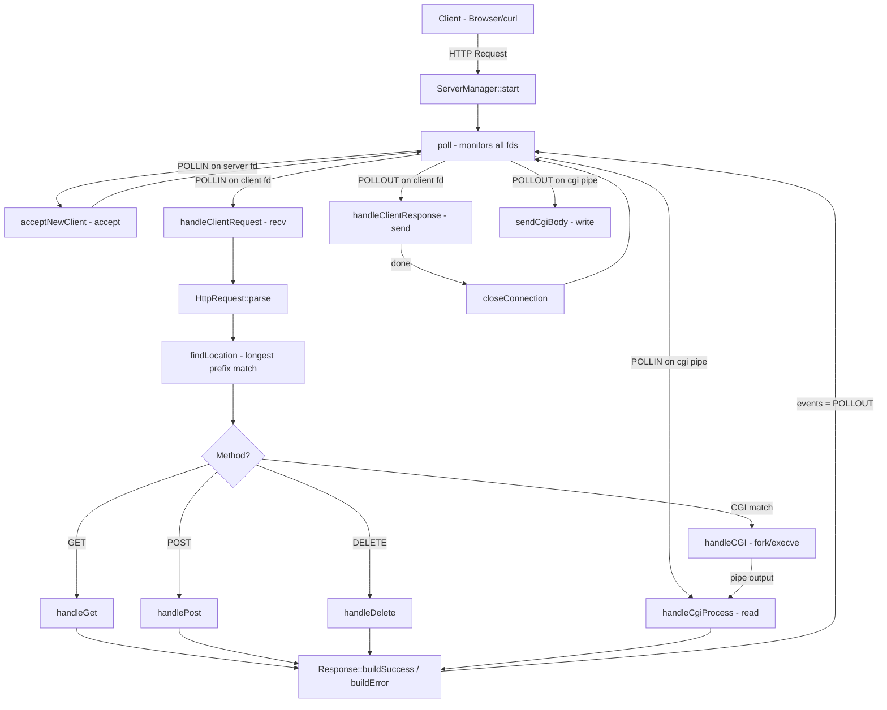
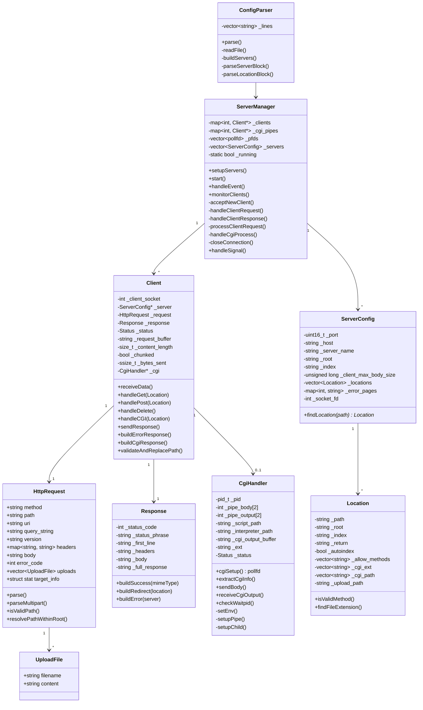

*This project has been created as part of the 42 curriculum by carlaugu, husamuel*

# webserv

## Description

A HTTP/1.1 web server implementation in C++98 that handles concurrent client connections using I/O multiplexing with `poll()`, without threads. The server supports static file serving, file uploads, CGI script execution, and an nginx-like configuration format.

### Features

| Feature | Description |
|---------|-------------|
| **Static file serving** | Serves HTML, CSS, JS, images, PDFs with correct MIME types |
| **GET** | File serving, directory index, autoindex, HTTP redirects (301) |
| **POST** | File uploads via multipart/form-data, chunked transfer encoding |
| **DELETE** | Delete files from the server |
| **CGI execution** | Runs Python (`.py`) and Bash (`.sh`) scripts via fork/exec |
| **Autoindex** | Generates directory listing when no index file is present |
| **Custom error pages** | Configurable per status code (404, 405, etc.) |
| **Path traversal protection** | Blocks `..` in request paths |
| **nginx-like configuration** | Server blocks, location blocks, routes, redirects |
| **Non-blocking I/O** | Handles multiple clients simultaneously with `poll()` |
| **Multiple servers** | Listen on multiple ports in the same config |

## Instructions

### Build

```bash
make
```

### Run

```bash
./webserv                        # uses configs/default.conf
./webserv configs/custom.conf    # custom config file
```

### Test

```bash
# Basic GET request
curl http://127.0.0.1:8002/

# File upload
curl -X POST -F "file=@test.txt" http://127.0.0.1:8002/upload

# Delete file
curl -X DELETE http://127.0.0.1:8002/upload/test.txt

# CGI script
curl http://127.0.0.1:8002/cgi-bin/time.py

# CGI with POST body
curl -X POST -d "hello" http://127.0.0.1:8002/cgi-bin/body.py

# Stress test
siege -b -c 50 -t 10S http://127.0.0.1:8002/
```

### Dependencies

None. The project uses only:
- C++98 Standard Library
- POSIX socket API (`sys/socket.h`, `netinet/in.h`, `poll.h`)

## Architecture



## Class Diagram



## Configuration

The server uses an nginx-inspired configuration format:

```nginx
server {
    listen 8002;
    host 0.0.0.0;
    server_name localhost;
    root www/site1;
    index index.html;
    client_max_body_size 300000;
    error_page 404 error_pages/404.html;
    error_page 405 error_pages/405.html;

    location / {
        allow_methods GET;
        autoindex off;
    }

    location /upload {
        autoindex on;
        allow_methods POST DELETE GET;
        upload_path www/uploads;
    }

    location /cgi-bin {
        root ./cgi-bin;
        allow_methods GET POST;
        cgi_path /usr/bin/python3 /bin/bash;
        cgi_ext .py .sh;
    }
}
```

### Supported Directives

| Level | Directive | Description |
|-------|-----------|-------------|
| Server | `listen` | TCP port |
| Server | `host` | Bind address |
| Server | `server_name` | Server hostname |
| Server | `root` | Document root directory |
| Server | `index` | Default index file |
| Server | `client_max_body_size` | Max request body in bytes |
| Server | `error_page` | Custom error page per status code |
| Location | `allow_methods` | Allowed HTTP methods |
| Location | `autoindex` | Enable directory listing (on/off) |
| Location | `return` | Redirect URL |
| Location | `root` | Override document root |
| Location | `index` | Override index file |
| Location | `upload_path` | Upload directory |
| Location | `cgi_path` | CGI interpreter paths |
| Location | `cgi_ext` | CGI file extensions |

## How It Works

1. **Startup**: `ConfigParser` reads the config file and creates `ServerConfig` objects
2. **Binding**: `ServerManager` creates non-blocking listening sockets for each server (socket, bind, listen)
3. **Event Loop**: `poll()` monitors all file descriptors for read/write readiness simultaneously
4. **Accept**: New connections are accepted and wrapped in `Client` objects
5. **Parse**: Incoming data is read with `recv()` and fed to `HttpRequest` which parses incrementally (header then body)
6. **Route**: The request path is matched against `Location` blocks using longest-prefix match
7. **Handle**: The appropriate handler (GET/POST/DELETE/CGI) processes the request and builds a `Response`
8. **Send**: The response is written back to the client socket with `send()`, then the connection is closed

## Resources

- [RFC 7230 - HTTP/1.1 Message Syntax and Routing](https://tools.ietf.org/html/rfc7230)
- [RFC 7231 - HTTP/1.1 Semantics and Content](https://tools.ietf.org/html/rfc7231)
- [RFC 3875 - The Common Gateway Interface (CGI) Version 1.1](https://tools.ietf.org/html/rfc3875)
- [Beej's Guide to Network Programming](https://beej.us/guide/bgnet/)
- [poll(2) man page](https://man7.org/linux/man-pages/man2/poll.2.html)

### How AI Was Used

AI (Claude) was used as a development aid — not to write code autonomously, but as a tool to accelerate problem-solving and understanding.

- **Debugging**: Reasoning through unexpected behavior (CGI race conditions, non-blocking I/O edge cases, pipe management)
- **RFC Specifications**: Translating HTTP/1.1 and CGI spec requirements into concrete implementation steps (chunked encoding, multipart parsing, environment variables)
- **Config Parser Design**: Discussing parsing strategies for nested blocks and multi-value directives
- **CGI Implementation**: Clarifying fork/exec setup, pipe redirection, and process lifecycle management
- **Code Review**: Identifying structural improvements and catching potential issues (errno usage, fd leaks, error handling)

> All final code was written, reviewed, and tested by the developers. AI was used as a reference and reasoning tool, not as a code generator.
