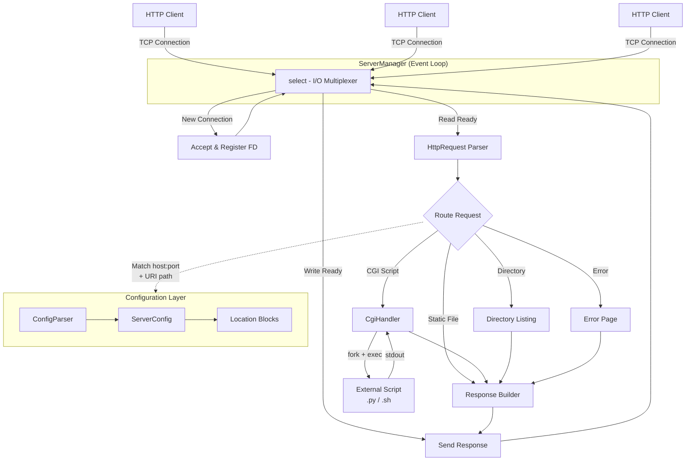
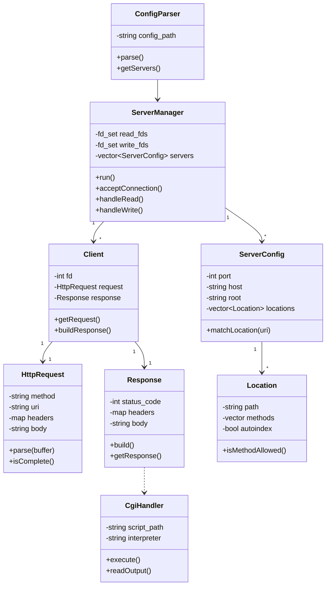

# Common Core - HTTP Web Server

A from-scratch HTTP/1.1 web server implementation in C++98 that handles concurrent client connections using I/O multiplexing (`select()`), without threads. Built as part of the 42 School curriculum.

## Project Structure

This repository contains two implementations:

| Project | Status | Description |
|---------|--------|-------------|
| `Webserv_42/` | Complete | Fully functional HTTP/1.1 server (~4300 LOC) |
| `webserver/` | In Development | Refactored version with cleaner architecture |

## Architecture



## Features

- **HTTP/1.1** compliant with keep-alive connections
- **Methods**: GET, HEAD, POST, PUT, DELETE
- **CGI execution** (Python, Shell scripts)
- **Multiple virtual servers** on different ports
- **Static file serving** with MIME type detection
- **Directory listing** (autoindex)
- **File uploads** via POST/PUT
- **Chunked transfer encoding**
- **Custom error pages**
- **nginx-like configuration** syntax

## Configuration

The server uses an nginx-inspired configuration format:

```nginx
server {
    listen 8080;
    host 127.0.0.1;
    server_name localhost;
    root docs/fusion_web/;
    index index.html;
    client_max_body_size 1048576;
    error_page 404 /error/404.html;

    location /cgi-bin {
        allow_methods GET POST;
        cgi_path /usr/bin/python3;
        cgi_ext .py .sh;
    }

    location /upload {
        allow_methods POST DELETE;
        client_max_body_size 2097152;
    }
}
```

## Build & Run

```bash
# Webserv_42 (complete)
cd Webserv_42
make
./webserv                    # uses configs/default.conf
./webserv configs/custom.conf

# webserver (in development)
cd webserver
make
./webserv
```

### Makefile Targets

| Target | Action |
|--------|--------|
| `make` | Compile the project |
| `make clean` | Remove object files |
| `make fclean` | Remove objects and binary |
| `make re` | Full rebuild |

## Dependencies

None. The project uses only:
- C++98 Standard Library
- POSIX/BSD socket API (`sys/socket.h`, `netinet/in.h`, `sys/select.h`)

## Component Overview



## How It Works

1. **Startup**: `ConfigParser` reads the config file and creates `ServerConfig` objects
2. **Binding**: `ServerManager` creates listening sockets for each server block
3. **Event Loop**: `select()` monitors all file descriptors for read/write readiness
4. **Accept**: New connections are accepted and wrapped in `Client` objects
5. **Parse**: Incoming data is fed to `HttpRequest` which parses incrementally
6. **Route**: The request URI is matched against `Location` blocks in the config
7. **Respond**: `Response` builds the appropriate HTTP response (static file, CGI output, error page)
8. **Send**: The response is written back to the client socket

## Testing

```bash
# Basic request
curl http://localhost:8080/

# File upload
curl -X POST -F "file=@test.txt" http://localhost:8080/upload/

# CGI script
curl http://localhost:8080/cgi-bin/calendar.sh

# Stress test (requires siege)
siege -b -c 100 -t 30S http://localhost:8080/
```

## How AI Was Used

AI (Claude) was used as a development aid throughout the project — not to write code autonomously, but as a tool to accelerate problem-solving and understanding.

### Debugging & Error Analysis
When the server produced unexpected behavior (e.g., incorrect HTTP responses, `select()` timeouts, CGI process leaks), AI was used to reason through the root cause by describing the symptoms and examining relevant code sections together.

### Understanding RFC Specifications
HTTP/1.1 (RFC 7230–7235) is dense. AI helped translate specific RFC requirements — such as chunked transfer encoding, keep-alive semantics, and header parsing rules — into concrete implementation steps.

### Configuration Parser Design
The nginx-like config parser presented edge cases (nested blocks, multi-value directives, whitespace handling). AI was used to discuss parsing strategies and validate logic before writing the final implementation.

### CGI Protocol Implementation
CGI has subtle requirements around environment variables, `fork()`/`exec()` setup, and reading stdout via pipes. AI was consulted to clarify these details and catch potential race conditions in the child process lifecycle.

### Code Review & Refactoring
The `webserver/` refactor used AI to identify structural improvements over `Webserv_42` — such as separating directive parsing into dedicated functions and cleaning up the `Location`/`ServerConfig` interfaces.

> **Note**: All final code was written, reviewed, and tested by the developers. AI was used as a reference and reasoning tool, not as a code generator.

## Constraints

- Written in **C++98** (no C++11 or later features)
- **No external libraries** allowed
- **No threads** — concurrency via `select()` only
- Must never crash or hang under any circumstances
- Compiled with `-Wall -Wextra -Werror`
